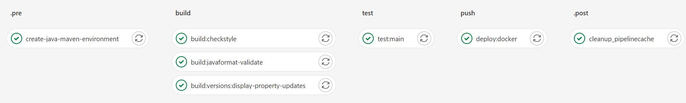

Thought, CI stages such as checking the code quality, unit tests, component tests, etc. and to perform image builds
using buildpacks directly. Provision of additional images, such as. e.g. for maven, omitted.

Example is a Spring Boot project with maven as build tool.

```
include:
- project: 'GitlabBuildpacks'
  ref: main
  file: '/auto.yml'
```

Pipeline of the demo
